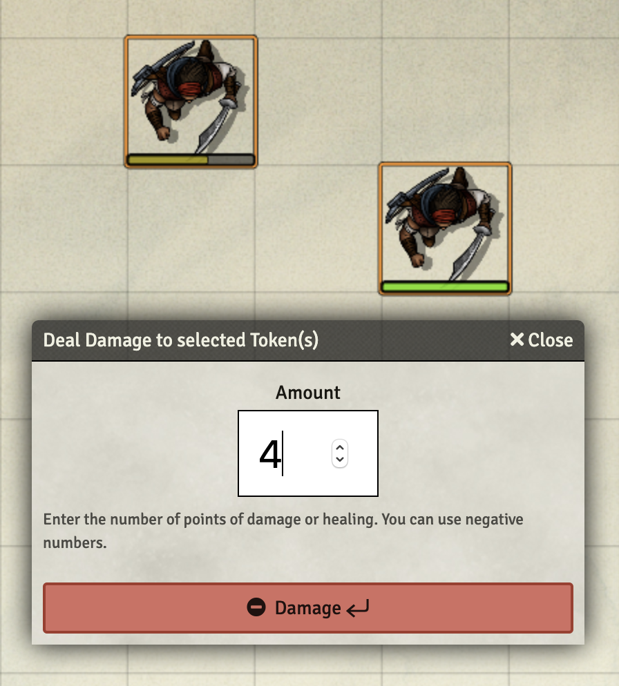

# Token Health

Apply damage/healing with a few keystrokes to all selected tokens at once.

## Description

This is a module for [FoundryVTT](https://foundryvtt.com/) intended for GMs that want to apply damage or healing more easily. Without this mod, you have to click several times to adjust the hit points of a token. With Token Health installed, you can hit Enter, enter the damage and hit Enter again. 

## Install

You can install this module directly from the "Add-on Modules" page on the FoudryVTT Setup screen. 

Make sure to enable the module once your world is launched, in the Manage Modules setting page. 

